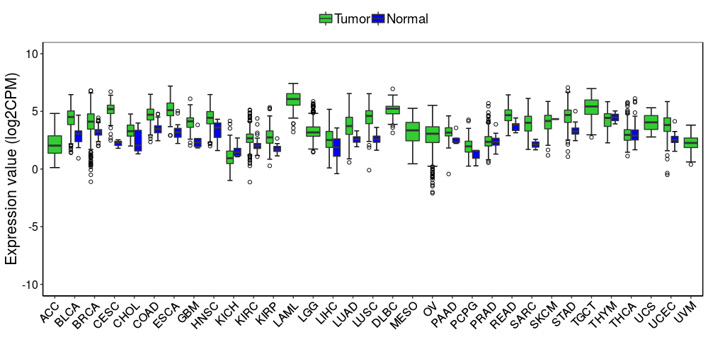

# Introduction
**This is a simple pipeline for expression and survival analyses of a single gene in all the TCGA projects.**

***

# Setup Environment 

```{r environment, eval=TRUE, message=FALSE, warning=FALSE}

setwd('~/Documents/Research/share/TCGA/')
source('batchTCGAFunctions.R')

library(RSQLite)
library(ggplot2)
library(survminer)
library(survival)
library(DT)

biotype <- read.table('TCGA.Homo_sapiens.GRCh38.90.biotype.final.entrez.txt', header=T,
                      stringsAsFactors = F)

projects <- c('TCGA-ACC', 'TCGA-BLCA', 'TCGA-BRCA', 'TCGA-CESC', 
              'TCGA-CHOL', 'TCGA-COAD', 'TCGA-ESCA', 'TCGA-GBM', 
              'TCGA-HNSC', 'TCGA-KICH', 'TCGA-KIRC', 'TCGA-KIRP', 
              'TCGA-LAML', 'TCGA-LGG', 'TCGA-LIHC','TCGA-LUAD', 
              'TCGA-LUSC', 'TCGA-DLBC', 'TCGA-MESO', 'TCGA-OV', 
              'TCGA-PAAD', 'TCGA-PCPG', 'TCGA-PRAD', 'TCGA-READ', 
              'TCGA-SARC', 'TCGA-SKCM', 'TCGA-STAD', 'TCGA-TGCT', 
              'TCGA-THYM', 'TCGA-THCA', 'TCGA-UCS','TCGA-UCEC', 
              'TCGA-UVM')

gene <- symbol2ensemblFun('BRCA1')
gene

```

***

# Create an SQL database of survival data in TCGA
```{r sql, eval=TRUE, message=FALSE, warning=FALSE}

db <- dbConnect(SQLite(), dbname='TCGA.survival.sqlite')
dbListTables(db)

for (project in projects) {
    prj <- strsplit(project, split = '-', fixed = TRUE)[[1]][2]
    
    survDa <- load(paste(project, paste('survival',prj, 'rda',sep='.'), sep='/'))
    survDa <- get(survDa)
    
    dbWriteTable(db, paste('survival', prj, sep='.'), survDa, row.names = TRUE)
}


dbListTables(db)
dbListFields(db, "survival.PRAD")

prad <- dbReadTable(db, "survival.PRAD", row.names=TRUE)

datatable(as.data.frame(prad), 
        options = list(scrollX = TRUE, pageLength = 5))

dbDisconnect(db)

```

***

# Gene expression analysis
## Data preparation
```{r gene expression, message=FALSE, warning=FALSE, eval=TRUE}

exprDa <- c()
prjs <- c()

for (project in projects) {
    prj <- strsplit(project, split = '-', fixed = TRUE)[[1]][2]
    prjs <- c(prjs, prj)
    
    ### gene expression
    rnaExpr <- load(paste(project, paste('rnaExpr',prj, 'rda',sep='.'), sep='/'))
    rnaMeta <- load(paste(project, paste('rnaMeta',prj, 'rda',sep='.'), sep='/'))
    
    ### pre miRNA expression
    #rnaExpr <- load(paste(project, paste('preExpr',prj, 'rda',sep='.'), sep='/'))
    #rnaMeta <- load(paste(project, paste('preMeta',prj, 'rda',sep='.'), sep='/'))
    
    rnaExpr <- get(rnaExpr)
    rnaMeta <- get(rnaMeta)
    
    ### gene expression
    #colnames(rnaExpr) == rnaMeta$sample
    
    #expr <- data.frame(expr=rnaExpr[symbol2ensemblFun(gene),], 
    #                   group=rnaMeta$sample_type,
    #                   project=prj)
    
    ### pre miRNA expression
    expr <- data.frame(expr=rnaExpr[gene,], 
                       group=rnaMeta$sample_type,
                       project=prj)
    
    exprDa <- rbind(exprDa, expr)
}

exprDa$project <- factor(exprDa$project, levels=prjs)
exprDa$group[exprDa$group=='PrimaryBloodDerivedCancer-PeripheralBlood'] <- 'PrimaryTumor'

exprDa$col <- ifelse(exprDa$group=='PrimaryTumor', 'limegreen', 'blue')
exprDa$col <- factor(exprDa$col, levels=c('limegreen', 'blue'))

dim(exprDa)

datatable(as.data.frame(exprDa), 
        options = list(scrollX = TRUE, pageLength = 5))
```


## T test
```{r t test, message=FALSE, warning=FALSE, eval=TRUE}
sumTable <- c()
for (prj in prjs) {
    expr <- exprDa[exprDa$project==prj,]
    
    nT <- sum(expr$group=='PrimaryTumor')
    nN <- sum(expr$group=='SolidTissueNormal')
    
    meanX <- as.numeric(format(mean(expr$expr[expr$group=='PrimaryTumor']), digits = 3))
    
    if (nN == 0) {
        sumTable <- rbind(sumTable, c(nT, 0, meanX, NA, NA, NA))
    } else if (nT == 0) {
        sumTable <- rbind(sumTable, c(0, nN, NA, meanY, NA, NA))
    } else if (nN==1) {
        tTest <- t.test(x=expr$expr[expr$group=='PrimaryTumor'], mu = expr$expr[expr$group=='SolidTissueNormal'])
        meanX <- as.numeric(format(mean(expr$expr[expr$group=='PrimaryTumor']), digits = 3))
        meanY <- as.numeric(format(mean(expr$expr[expr$group=='SolidTissueNormal']), digits = 3))
        
        pVal <- tTest$p.value
        pVal <- as.numeric(format(pVal, digits = 3))
        #est <- as.numeric(format(tTest$estimate, digits = 3))
        t <- as.numeric(format(tTest$statistic, digits = 3))
        
        sumTable <- rbind(sumTable, c(nT, nN, meanX, meanY, t, pVal))
        
        #sumTable <- rbind(sumTable, c(nT, nN, mean(expr$expr[expr$group=='PrimaryTumor']), 
        #                              mean(expr$expr[expr$group=='SolidTissueNormal']), NA, NA))
    } else {
        tTest <- t.test(x=expr$expr[expr$group=='PrimaryTumor'], y=expr$expr[expr$group=='SolidTissueNormal'])
        
        meanX <- as.numeric(format(mean(expr$expr[expr$group=='PrimaryTumor']), digits = 3))
        meanY <- as.numeric(format(mean(expr$expr[expr$group=='SolidTissueNormal']), digits = 3))
        
        pVal <- tTest$p.value
        pVal <- as.numeric(format(pVal, digits = 3))
        #est <- as.numeric(format(tTest$estimate, digits = 3))
        t <- as.numeric(format(tTest$statistic, digits = 3))
        
        sumTable <- rbind(sumTable, c(nT, nN, meanX, meanY, t, pVal))
    }
    
}
rownames(sumTable) <- projects
colnames(sumTable) <- c('Tumor','Normal', 'meanTumor', 'meanNormal', 't', 'p')

datatable(as.data.frame(sumTable), 
        options = list(scrollX = TRUE, pageLength = 5))
```


## Boxplot
```{r boxplot, message=FALSE, warning=FALSE, eval=TRUE}
bxplt <- ggplot(exprDa, aes(x=project, y=expr, fill=col)) + # fill=interaction(group,project))
    stat_boxplot(geom ='errorbar', width=0.5, position = position_dodge(width = 0.75))+
    
    geom_boxplot(outlier.colour = 'black', outlier.shape = 21,
                 outlier.fill = NA) +
    scale_fill_manual(values=c('limegreen', 'blue'),
                      labels=c('Tumor', 'Normal'),
                      name='Sample type') +
    xlab('')+ylab('Expression value (log2CPM)') +
    theme_bw()+
    theme(legend.title = element_blank(),
          legend.text = element_text(size=14),
          legend.position = 'top') +
    theme(axis.title=element_text(size=16), 
          axis.text = element_text(color='black', size=12),
          axis.text.x = element_text(angle = 45, hjust=1)) +
    ylim(-10,10) +
    theme(axis.line = element_line(colour = "black"),
          panel.grid.major = element_blank(),
          panel.grid.minor = element_blank(),
          panel.border = element_rect(color='black'),
          panel.background = element_blank())
```

```{r boxplot 2, message=FALSE, warning=FALSE, eval=FALSE}
bxplt
```




***

# Survival analysis (OS and RFS)
## KM analysis
```{r survival, message=FALSE, warning=FALSE, eval=TRUE}
osRes <- c()
rfsRes <- c()
prjs <- c()

for (project in projects) {
    print (project)
    
    if (project=='TCGA-GBM') {
        osRes <- rbind(osRes, rep(NA,4))
        rfsRes <- rbind(rfsRes, rep(NA,4))
        next
    }
    
    prj <- strsplit(project, split = '-', fixed = TRUE)[[1]][2]
    prjs <- c(prjs, prj)
    
    #rnaExpr <- load(paste(project, paste('rnaExpr',prj, 'rda',sep='.'), sep='/'))
    rnaExpr <- load(paste(project, paste('rnaExpr',prj, 'rda',sep='.'), sep='/'))
    survDa <- load(paste(project, paste('survival',prj, 'rda',sep='.'), sep='/'))
    
    rnaExpr <- get(rnaExpr)
    survDa <- get(survDa)
    
    samples <- intersect(colnames(rnaExpr), rownames(survDa))
    
    #expr=rnaExpr[symbol2ensemblFun(gene),samples]
    expr=rnaExpr[gene,samples]
    survDa <- survDa[samples,]
    
    km <- kmTest(exprDa=expr, daysToDeath=survDa$OS, vitalStatus=survDa$OS_status)
    osRes <- rbind(osRes, as.numeric(format(km, digits=3)))
    
    km <- kmTest(exprDa=expr, daysToDeath=survDa$RFS, vitalStatus=survDa$RFS_status)
    rfsRes <- rbind(rfsRes, as.numeric(format(km, digits=3)))
    
}

### OS
colnames(osRes) <- c('HR','lower95','upper95','pValue')
rownames(osRes) <- projects
datatable(as.data.frame(osRes), 
        options = list(scrollX = TRUE, pageLength = 5))

### RFS
colnames(rfsRes) <- c('HR','lower95','upper95','pValue')
rownames(rfsRes) <- projects
datatable(as.data.frame(rfsRes), 
        options = list(scrollX = TRUE, pageLength = 5))
```

## KM survival curve
```{r km plot, message=FALSE, warning=FALSE, eval=TRUE}
project <- 'TCGA-PRAD'
kmplt <- kmPlot(gene = gene, project=project, type='RFS')
```


```{r km plot 2, message=FALSE, warning=FALSE, eval=FALSE}
kmplt
```


***

# sessionInfo
```{r sessionInfo}
sessionInfo()
```

